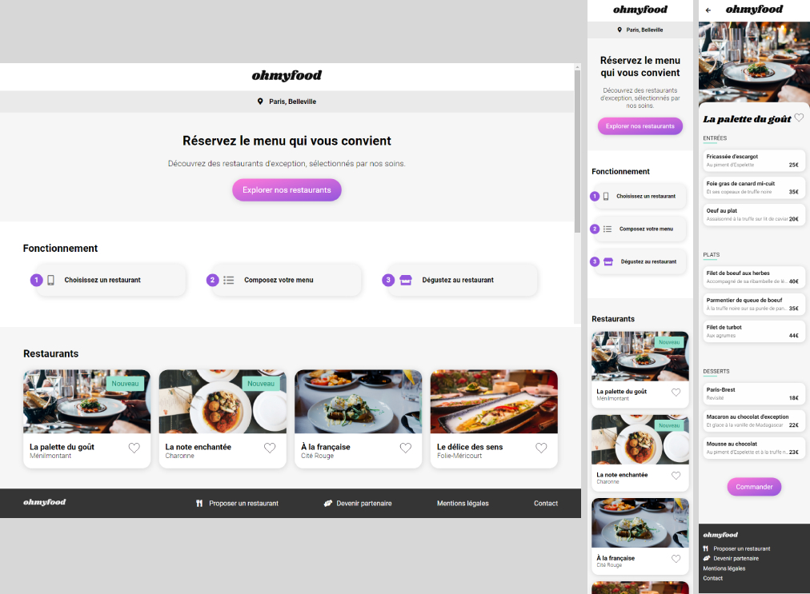

# Ohmyfood - Online meal ordering website (Part 1)



The concept of Ohmyfood is to order meals online. Users should be able to compose their own menu and reduce their waiting time in restaurants because their menus are prepared in advance. This project is a two phases project. In the first place, the goal is to develop a site offering four restaurants menus. Secondly, the online reservation and menu composition functions will be implemented.

<details open>
<summary>Table of contents</summary>

1. [Overview](#overview)
    - [About the project](#about-the-project)
    - [Links](#links)
2. [My process](#my-process)
    - [Built with](#built-with)
    - [What I learned](#what-i-learned)
    - [Continued development](#continued-development)
    - [Usefull resources](#usefull-resources)
3. [Authors](#authors)
</details>

## Overview

### About the project

#### Pages content
##### Header
- A header must be on all pages
- On home page, it contains the brand logo
- On menu pages, there should also be a back button to the home page 

##### Home page
- The user must be able to see the location of the restaurants. In phase 2, he will be able to choose it.
- The user must be able to see the four menus in the shape of a card and be redirected to the menu page after a click.

##### Menu pages
- There should be four pages each offering the menu of a restaurant

##### Footer
- The footer is the same for all pages.
- When you click on “Contact” link, a forwarding to an email address is made.

#### Graphic effects and animations

##### Buttons
- Background color should slightly lighten and the shadow be more visible when hovering.
- The "like" button should gradually fill up when on click. For this first version, the effect can appear on hover.

##### Home page
- A loading spinner must appear for 1 to 3 seconds when you arrive on the home page, cover the entire screen, and use CSS animations (no library).

##### Menu pages
- The dishes should appear gradually with a slight shift in time, either one by one, or by group "Entrées", "Plat" and "Desserts".
- In phase 2, visitors can add the dishes they want to their order by clicking on them. This brings up a small checkbox to the right of the dish. This checkbox should slide from right to left. For this first version, the effect can appear on hover on desktop instead of the click. If the title of the dish is too long, it should be trimmed with ellipsis.

#### Compatibility
- The website must be developped using a mobile-first approach
- It must be responsive with a free layout on tablet and desktop.

### Links
Mobile mockup: [Home Page](src/mockup/accueil.png) [La palette du goût](src/mockup/menu-lapalettedugout.png) [La note enchantée](src/mockup/menu-lanoteenchantee.png) [(À la française](src/mockup/menu-alafrançaise.png) [Le délice des sens](src/mockup/menu-ledelicedessens.png)   
Live Site: [Here](https://desireebesnard.github.io/DesireeBesnard_3_08092021/)  

## My process

### Built with
- Semantic HTML5
- Font Awesome (icons)
- SCSS (Sass)
- Flexbox and CSS Grid
- Mobile-first workflow

### What I learned

#### Write better structured code and faster with Sass

##### Install sass (Linux)
```
sudo apt install nodejs
npm -g install sass
``` 

##### 7-1 Sass Architecture
```
sass/
|
|– utils/
|   |– _variables.scss           # Sass Variables
|   |– _mixins.scss              # Sass Mixins
|   |– _animations.scss          # Keyframes Animation
|
|– base/
|   |– _base.scss                # Reset/normalize
|   |– _typography.scss          # Typography rules
|
|– layouts/
|   |– _header.scss              # Header
|   |– _main-description.scss    # Presentation of the company
|   |– _main-restaurants.scss    # Restaurant cards layout
|   |– _main-menu.scss           # Menu layout
|   |– _footer.scss              # Footer
|   |– _mediaqueries.scss        # Media queries
|
|– components/
|   |– _button.scss              # Button
|   |– _spinner.scss             # Loading spinner
|
 – main.scss                     # Main Sass input file
```

##### Mixins
```
@mixin box-shadow {
    box-shadow: 1px 2px 15px 0px rgb(0 0 0 / 15%);
}
//The mixin is included into the current context using the @include at-rule
@include box-shadow;
``` 

##### Improve code maintainability with Sass variables
```
$gray: #F6F6F6;
background-color: $gray;
``` 

#### Create graphic effects

##### Linear Gradient on svg
```
<svg viewBox="0 0 32 32">
    <defs>
        <linearGradient id="heart__gradient" x1="0%" y1="0%" x2="0%" y2="100%">
            <stop class="gradientstop1" offset="0%"/>
            <stop class="gradientstop2" offset="100%"/>
        </linearGradient>
    </defs>
    <path fill="url(#heart__gradient)" d="M23.6,0c-3.4,0-6.3,2.7-7.6,5.6C14.7,2.7,11.8,0,8.4,0C3.8,0,0,3.8,0,8.4c0,9.4,9.5,11.9,16,21.2c6.1-9.3,16-12.1,16-21.2C32,3.8,28.2,0,23.6,0z"/>
</svg>
``` 

##### Create more complex animations with the @keyframes CSS rule
```
@keyframes dot-1-move {
    0% {
      transform: translate(-50%, -50%) scale(1);
    }
    20% {
      transform: translate(-34%, -29%) scale(0.45);
    }
    40% {
      transform: translate(-16%, -12%) scale(0.45);
    }
    60% {
      transform: translate(-16%, -12%) scale(0.45);
    }
    80% {
      transform: translate(-34%, -29%) scale(0.45);
    }
    100% {
      transform: translate(-50%, -50%) scale(1);
    }
}

@keyframes z-index {
    0% {
      z-index: 1;
    }
    33% {
      z-index: 2;
    }
    66% {
      z-index: 3;
    }
    100% {
      z-index: 1;
    }
}

animation: dot-1-move 2s ease infinite, z-index 6s ease infinite;
``` 

#### Ensure the graphic consistency of a website (using media queries for tablets and desktop)

### Continued development
- Use javascript for click-triggered animations (heart button animation and select a dish)
- Add the possibility to choose a location
- Add online reservation and menu composition functions 

### Useful ressources
- [7-1 Sass Architecture](https://www.learnhowtoprogram.com/user-interfaces/building-layouts-preprocessors/7-1-sass-architecture) - This helped me understand the Git workflow, learn Markdown and document my projects
- [SVG Gradients](https://la-cascade.io/les-degrades-svg/) - A short but complete explanation of the possibilities of linear gradient (french ressource)
- [Implementing Multiple Loading Spinners Made with Pure CSS and HTML](https://dev.to/fadinouh1/implementing-multiple-loading-spinners-made-with-pure-css-and-html-9p4) - Some inspiration for loading spinners
- [Responsive, Mobile First](https://grafikart.fr/tutoriels/responsive-mobile-first-550) - A tutorial to understand the concept of mobile-first (french ressource)

## Authors
- Website - [Désirée Besnard](https://github.com/DesireeBesnard)
- MockUp - [OpenClassRooms](https://openclassrooms.com/fr/)